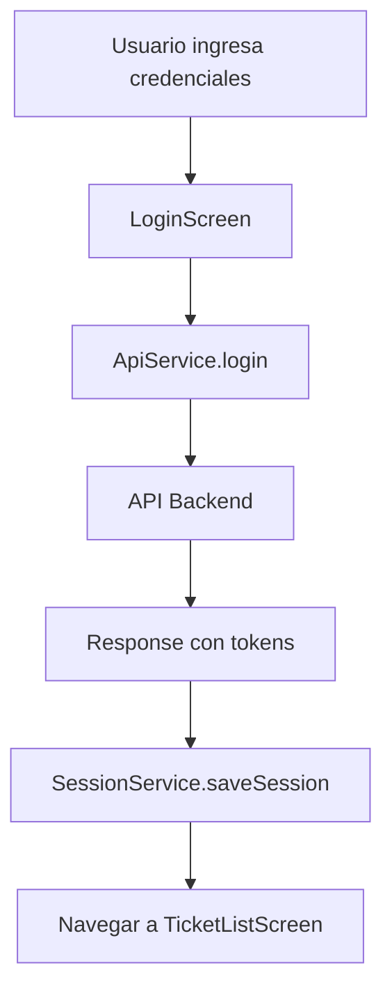
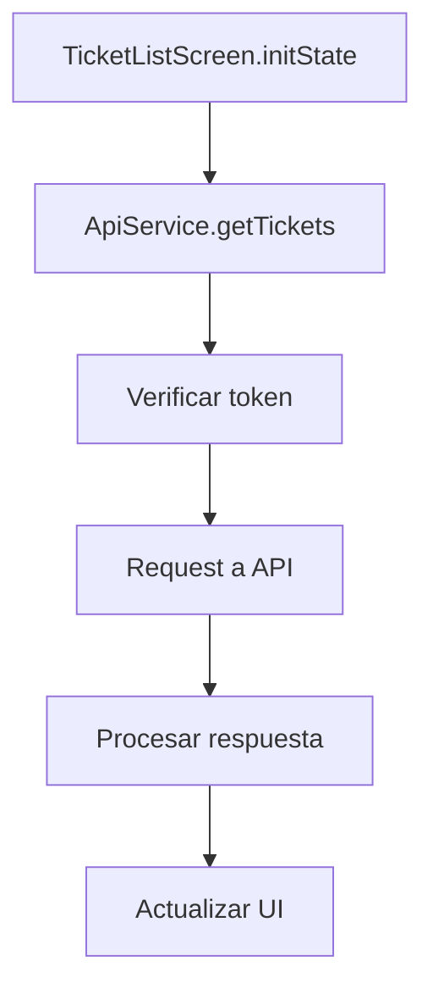
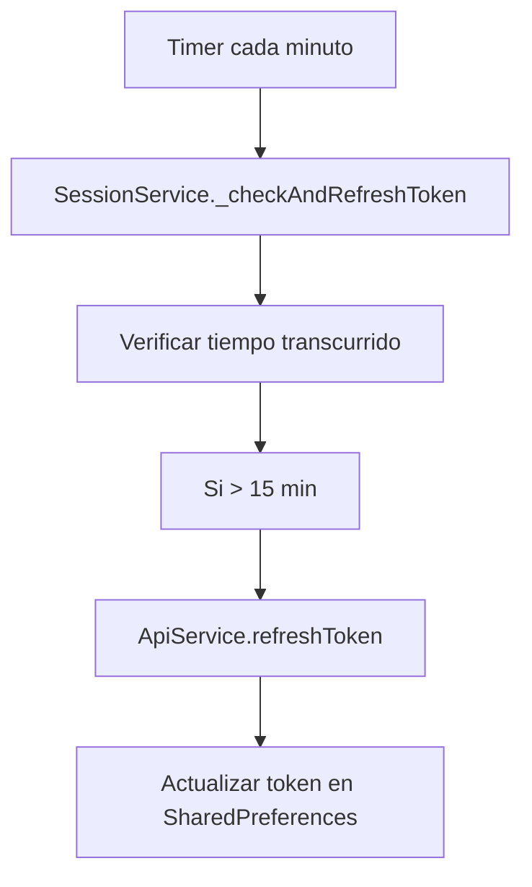

# 🛠️ Guía de Desarrollador - LHTickets

## 📚 Índice
1. [Configuración del Entorno](#configuración-del-entorno)
2. [Arquitectura del Código](#arquitectura-del-código)
3. [Patrones de Diseño](#patrones-de-diseño)
4. [API Reference](#api-reference)
5. [Flujo de Datos](#flujo-de-datos)
6. [Testing](#testing)
7. [Debugging](#debugging)
8. [Optimización](#optimización)

## 🔧 Configuración del Entorno

### Requisitos del Sistema
```bash
# Verificar versiones
flutter --version
dart --version
node --version
npm --version
```

### Configuración de IDE (VS Code)
```json
{
  "dart.flutterSdkPath": "path/to/flutter",
  "dart.lineLength": 80,
  "editor.formatOnSave": true,
  "editor.codeActionsOnSave": {
    "source.fixAll": true
  }
}
```

### Extensiones Recomendadas
- Dart
- Flutter
- Flutter Widget Snippets
- Error Lens
- GitLens

## 🏗️ Arquitectura del Código

### Estructura de Servicios

#### ApiService (`lib/services/api_service.dart`)
```dart
class ApiService {
  // Configuración
  final String baseUrl = 'https://apilhtickets-927498545444.us-central1.run.app/api';
  
  // Métodos principales
  Future<Map<String, dynamic>> login(String correo, String clave)
  Future<String> refreshToken(String refreshToken)
  Future<List<dynamic>> getTickets()
  Future<Map<String, dynamic>> createTicket(Map<String, dynamic> ticketData)
  
  // Método genérico para requests protegidos
  Future<http.Response> protectedRequest(Future<http.Response> Function(String token) requestFn)
}
```

**Características clave:**
- Manejo automático de renovación de tokens
- Interceptación de errores 401
- Formateo consistente de respuestas
- Validación de datos de entrada

#### SessionService (`lib/services/session_service.dart`)
```dart
class SessionService {
  // Configuración de tiempo
  static const int TOKEN_EXPIRATION_TIME = 20 * 60 * 1000; // 20 minutos
  static const int TOKEN_REFRESH_TIME = 15 * 60 * 1000;     // 15 minutos
  
  // Métodos principales
  Future<void> saveSession(String accessToken, String refreshToken, Map<String, dynamic> userData)
  Future<bool> hasActiveSession()
  Future<void> clearSession()
  
  // Renovación automática
  void _startTokenRefreshTimer()
  Future<void> _checkAndRefreshToken()
}
```

**Características clave:**
- Singleton pattern para gestión global
- Timer automático para renovación de tokens
- Manejo de contexto para navegación
- Limpieza automática al cerrar navegador

### Estructura de Pantallas

#### Patrón de Pantallas
```dart
class ExampleScreen extends StatefulWidget {
  final ApiService apiService;
  final SessionService sessionService;

  const ExampleScreen({
    Key? key,
    required this.apiService,
    required this.sessionService,
  }) : super(key: key);

  @override
  _ExampleScreenState createState() => _ExampleScreenState();
}
```

#### Gestión de Estado
```dart
class _ExampleScreenState extends State<ExampleScreen> {
  bool _isLoading = false;
  List<dynamic> _data = [];
  String _searchQuery = '';
  
  @override
  void initState() {
    super.initState();
    _loadData();
  }
  
  Future<void> _loadData() async {
    setState(() => _isLoading = true);
    try {
      final data = await widget.apiService.getData();
      setState(() {
        _data = data;
        _isLoading = false;
      });
    } catch (e) {
      setState(() => _isLoading = false);
      _showError(e.toString());
    }
  }
}
```

## 🎨 Patrones de Diseño

### 1. Dependency Injection
```dart
// En main.dart
final sessionService = SessionService();
final apiService = ApiService();

runApp(MyApp(
  sessionService: sessionService,
  apiService: apiService,
));

// En pantallas
class TicketListScreen extends StatefulWidget {
  final ApiService apiService;
  final SessionService sessionService;
  
  const TicketListScreen({
    required this.apiService,
    required this.sessionService,
  });
}
```

### 2. Service Layer Pattern
```dart
// Separación de responsabilidades
class ApiService {
  // Solo comunicación con API
}

class SessionService {
  // Solo gestión de sesión
}

class TicketService {
  // Lógica de negocio específica de tickets
}
```

### 3. Repository Pattern (Implícito)
```dart
// Los servicios actúan como repositorios
class ApiService {
  Future<List<Ticket>> getTickets() async {
    // Lógica de obtención de datos
  }
  
  Future<void> createTicket(Ticket ticket) async {
    // Lógica de creación
  }
}
```

## 🔌 API Reference

### Endpoints Principales

#### Autenticación
```dart
// POST /api/auth/login
{
  "correo": "string",
  "clave": "string"
}

// Response
{
  "access_token": "string",
  "refresh_token": "string",
  "usuario": {
    "id": "number",
    "nombre": "string",
    "id_rol": "number",
    "sucursal_activa": {
      "nombre": "string"
    }
  }
}
```

#### Tickets
```dart
// GET /api/tickets
// Headers: Authorization: Bearer <token>

// POST /api/tickets
{
  "titulo": "string",
  "descripcion": "string",
  "prioridad": "string",
  "id_departamento": "number",
  "adjunto": "string (opcional)"
}

// PUT /api/tickets/{id}
{
  "estado": "string",
  "id_agente": "number (opcional)"
}
```

#### Usuarios
```dart
// GET /api/usuarios
// POST /api/auth/register
// PUT /api/usuarios/{id}
// DELETE /api/usuarios/{id}
```

### Manejo de Errores
```dart
try {
  final response = await apiService.getData();
  // Procesar respuesta
} catch (e) {
  if (e.toString().contains('401')) {
    // Token expirado
    await sessionService.clearSession();
    Navigator.pushReplacementNamed(context, '/login');
  } else {
    // Otro error
    ScaffoldMessenger.of(context).showSnackBar(
      SnackBar(content: Text('Error: ${e.toString()}')),
    );
  }
}
```

## 🔄 Flujo de Datos

### 1. Inicio de Sesión


### 2. Carga de Tickets


### 3. Renovación de Token


## 🧪 Testing

### Configuración de Tests
```yaml
# pubspec.yaml
dev_dependencies:
  flutter_test:
    sdk: flutter
  mockito: ^5.4.4
  build_runner: ^2.4.8
```

### Ejemplo de Test Unitario
```dart
// test/services/api_service_test.dart
import 'package:flutter_test/flutter_test.dart';
import 'package:mockito/mockito.dart';

void main() {
  group('ApiService Tests', () {
    test('login should return user data on success', () async {
      // Arrange
      final apiService = ApiService();
      
      // Act
      final result = await apiService.login('test@test.com', 'password');
      
      // Assert
      expect(result, contains('access_token'));
      expect(result, contains('usuario'));
    });
  });
}
```

### Ejemplo de Test de Widget
```dart
// test/screens/login_screen_test.dart
import 'package:flutter_test/flutter_test.dart';

void main() {
  testWidgets('Login screen shows form fields', (WidgetTester tester) async {
    await tester.pumpWidget(LoginScreen(
      apiService: ApiService(),
      sessionService: SessionService(),
    ));
    
    expect(find.byType(TextFormField), findsNWidgets(2));
    expect(find.byType(ElevatedButton), findsOneWidget);
  });
}
```

## 🐛 Debugging

### Configuración de Debug
```dart
// En main.dart
void main() async {
  WidgetsFlutterBinding.ensureInitialized();
  
  // Habilitar logs detallados en debug
  if (kDebugMode) {
    print('🔧 Debug mode enabled');
  }
  
  runApp(MyApp());
}
```

### Herramientas de Debug
```dart
// Logs estructurados
print('🔍 [DEBUG] Loading tickets...');
print('✅ [SUCCESS] Tickets loaded: ${tickets.length}');
print('❌ [ERROR] Failed to load tickets: $error');

// Debug de API
class ApiService {
  Future<List<dynamic>> getTickets() async {
    if (kDebugMode) {
      print('🌐 [API] GET /tickets');
    }
    // ... resto del código
  }
}
```

### Debug de Estado
```dart
// Widget para debug de estado
class DebugWidget extends StatelessWidget {
  final String title;
  final dynamic data;
  
  const DebugWidget({required this.title, required this.data});
  
  @override
  Widget build(BuildContext context) {
    if (!kDebugMode) return SizedBox.shrink();
    
    return Card(
      child: Padding(
        padding: EdgeInsets.all(8),
        child: Column(
          crossAxisAlignment: CrossAxisAlignment.start,
          children: [
            Text('🐛 DEBUG: $title', style: TextStyle(fontWeight: FontWeight.bold)),
            Text(data.toString()),
          ],
        ),
      ),
    );
  }
}
```

## ⚡ Optimización

### 1. Lazy Loading
```dart
// Carga progresiva de datos
class TicketListScreen extends StatefulWidget {
  @override
  Widget build(BuildContext context) {
    return ListView.builder(
      itemCount: tickets.length,
      itemBuilder: (context, index) {
        if (index >= tickets.length - 5) {
          _loadMoreTickets();
        }
        return TicketCard(ticket: tickets[index]);
      },
    );
  }
}
```

### 2. Caché de Datos
```dart
// Caché simple en memoria
class DataCache {
  static final Map<String, dynamic> _cache = {};
  static const Duration _cacheExpiration = Duration(minutes: 5);
  
  static void set(String key, dynamic data) {
    _cache[key] = {
      'data': data,
      'timestamp': DateTime.now(),
    };
  }
  
  static dynamic get(String key) {
    final cached = _cache[key];
    if (cached != null) {
      final age = DateTime.now().difference(cached['timestamp']);
      if (age < _cacheExpiration) {
        return cached['data'];
      }
    }
    return null;
  }
}
```

### 3. Optimización de Imágenes
```dart
// Compresión de imágenes antes de subir
Future<Uint8List> compressImage(Uint8List imageBytes) async {
  final codec = await instantiateImageCodec(
    imageBytes,
    targetWidth: 800, // Reducir tamaño
    targetHeight: 600,
  );
  final frame = await codec.getNextFrame();
  final data = await frame.image.toByteData(format: ImageByteFormat.png);
  return data!.buffer.asUint8List();
}
```

### 4. Bundle Splitting
```dart
// Carga condicional de dependencias
class ConditionalImport {
  static Future<void> loadPdfLibrary() async {
    if (kIsWeb) {
      // Cargar solo en web
      await import('package:pdf/pdf.dart');
    }
  }
}
```

## 📋 Checklist de Desarrollo

### Antes de Commit
- [ ] Código formateado (`dart format .`)
- [ ] Tests pasando (`flutter test`)
- [ ] Análisis estático (`flutter analyze`)
- [ ] Build exitoso (`flutter build web`)
- [ ] Documentación actualizada

### Antes de Deploy
- [ ] Variables de entorno configuradas
- [ ] Build de producción exitoso
- [ ] Tests de integración pasando
- [ ] Performance auditada
- [ ] Seguridad verificada

### Monitoreo en Producción
- [ ] Logs de errores
- [ ] Métricas de rendimiento
- [ ] Uso de recursos
- [ ] Feedback de usuarios

---

**Documentación técnica actualizada: $(date)** 📅 